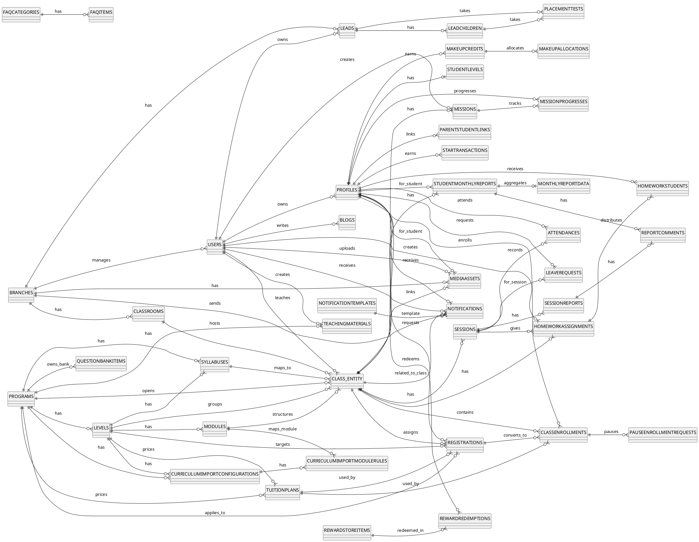

# Conceptual ERD (Non-Finance) - Overview

Nguon schema: `Kidzgo.Infrastructure/Migrations/ApplicationDbContextModelSnapshot.cs` (project hien tai).

## Pham vi da loai bo (tai chinh)
Da bo cac entity:
- `invoices`
- `invoice_lines`
- `payments`
- `cashbook_entries`
- `contracts`
- `shift_attendance`
- `monthly_work_hours`
- `session_roles`
- `payroll_lines`
- `payroll_runs`
- `payroll_payments`

## So do tong quan (bang chinh)

```mermaid
erDiagram
  BRANCHES ||--o{ USERS : manages
  USERS ||--o{ PROFILES : owns
  PROFILES ||--o{ PARENTSTUDENTLINKS : links

  BRANCHES ||--o{ LEADS : has
  USERS ||--o{ LEADS : owns
  LEADS ||--o{ LEADCHILDREN : has
  LEADS ||--o{ PLACEMENTTESTS : takes
  LEADCHILDREN ||--o{ PLACEMENTTESTS : takes

  PROGRAMS ||--o{ LEVELS : has
  LEVELS ||--o{ MODULES : has
  PROGRAMS ||--o{ TUITIONPLANS : prices
  LEVELS ||--o{ TUITIONPLANS : prices
  TUITIONPLANS ||--o{ REGISTRATIONS : used_by
  TUITIONPLANS ||--o{ CLASSENROLLMENTS : used_by
  PROGRAMS ||--o{ CLASS_ENTITY : opens
  LEVELS ||--o{ CLASS_ENTITY : groups
  MODULES ||--o{ CLASS_ENTITY : structures
  PROGRAMS ||--o{ SYLLABUSES : has
  LEVELS ||--o{ SYLLABUSES : has
  SYLLABUSES ||--o{ CLASS_ENTITY : maps_to
  PROGRAMS ||--o{ CURRICULUMIMPORTCONFIGURATIONS : has
  LEVELS ||--o{ CURRICULUMIMPORTCONFIGURATIONS : has
  CURRICULUMIMPORTCONFIGURATIONS ||--o{ CURRICULUMIMPORTMODULERULES : has
  MODULES ||--o{ CURRICULUMIMPORTMODULERULES : maps_module
  PROGRAMS ||--o{ QUESTIONBANKITEMS : owns_bank
  BRANCHES ||--o{ CLASSROOMS : has
  CLASSROOMS ||--o{ CLASS_ENTITY : hosts
  CLASS_ENTITY ||--o{ SESSIONS : has
  USERS ||--o{ CLASS_ENTITY : teaches
  BRANCHES ||--o{ MEDIAASSETS : has
  USERS ||--o{ MEDIAASSETS : uploads
  CLASS_ENTITY ||--o{ MEDIAASSETS : links
  PROFILES ||--o{ MEDIAASSETS : for_student
  USERS ||--o{ BLOGS : writes
  FAQCATEGORIES ||--o{ FAQITEMS : has
  PROGRAMS ||--o{ TEACHINGMATERIALS : has
  USERS ||--o{ TEACHINGMATERIALS : creates

  PROFILES ||--o{ REGISTRATIONS : requests
  PROGRAMS ||--o{ REGISTRATIONS : applies_to
  LEVELS ||--o{ REGISTRATIONS : targets
  CLASS_ENTITY ||--o{ REGISTRATIONS : assigns
  REGISTRATIONS ||--o{ CLASSENROLLMENTS : converts_to
  CLASS_ENTITY ||--o{ CLASSENROLLMENTS : contains
  PROFILES ||--o{ CLASSENROLLMENTS : enrolls

  SESSIONS ||--o{ ATTENDANCES : records
  PROFILES ||--o{ ATTENDANCES : attends

  CLASS_ENTITY ||--o{ HOMEWORKASSIGNMENTS : has
  SESSIONS ||--o{ HOMEWORKASSIGNMENTS : gives
  USERS ||--o{ HOMEWORKASSIGNMENTS : creates
  HOMEWORKASSIGNMENTS ||--o{ HOMEWORKSTUDENTS : distributes
  PROFILES ||--o{ HOMEWORKSTUDENTS : receives

  PROFILES ||--o{ LEAVEREQUESTS : requests
  SESSIONS ||--o{ LEAVEREQUESTS : for_session
  PROFILES ||--o{ MAKEUPCREDITS : earns
  MAKEUPCREDITS ||--o{ MAKEUPALLOCATIONS : allocates
  CLASSENROLLMENTS ||--o{ PAUSEENROLLMENTREQUESTS : pauses

  SESSIONS ||--o{ SESSIONREPORTS : has
  CLASS_ENTITY ||--o{ STUDENTMONTHLYREPORTS : has
  PROFILES ||--o{ STUDENTMONTHLYREPORTS : for_student
  STUDENTMONTHLYREPORTS ||--o| MONTHLYREPORTDATA : aggregates
  STUDENTMONTHLYREPORTS ||--o{ REPORTCOMMENTS : has
  SESSIONREPORTS ||--o{ REPORTCOMMENTS : has

  CLASS_ENTITY ||--o{ MISSIONS : has
  USERS ||--o{ MISSIONS : creates
  MISSIONS ||--o{ MISSIONPROGRESSES : tracks
  PROFILES ||--o{ MISSIONPROGRESSES : progresses
  PROFILES ||--o{ STARTRANSACTIONS : earns
  PROFILES ||--o| STUDENTLEVELS : has
  PROFILES ||--o{ REWARDREDEMPTIONS : redeems
  REWARDSTOREITEMS ||--o{ REWARDREDEMPTIONS : redeemed_in

  NOTIFICATIONTEMPLATES ||--o{ NOTIFICATIONS : template
  BRANCHES ||--o{ NOTIFICATIONS : sends
  CLASS_ENTITY ||--o{ NOTIFICATIONS : related_to_class
  USERS ||--o{ NOTIFICATIONS : receives
  PROFILES ||--o{ NOTIFICATIONS : receives
```

## PlantUML code (Overview)

```plantuml
@startuml
hide circle
skinparam linetype ortho

entity BRANCHES
entity USERS
entity PROFILES
entity PARENTSTUDENTLINKS
entity LEADS
entity LEADCHILDREN
entity PLACEMENTTESTS
entity PROGRAMS
entity LEVELS
entity MODULES
entity TUITIONPLANS
entity SYLLABUSES
entity CURRICULUMIMPORTCONFIGURATIONS
entity CURRICULUMIMPORTMODULERULES
entity QUESTIONBANKITEMS
entity CLASSROOMS
entity CLASS_ENTITY
entity MEDIAASSETS
entity BLOGS
entity FAQCATEGORIES
entity FAQITEMS
entity TEACHINGMATERIALS
entity SESSIONS
entity REGISTRATIONS
entity CLASSENROLLMENTS
entity ATTENDANCES
entity HOMEWORKASSIGNMENTS
entity HOMEWORKSTUDENTS
entity LEAVEREQUESTS
entity MAKEUPCREDITS
entity MAKEUPALLOCATIONS
entity PAUSEENROLLMENTREQUESTS
entity SESSIONREPORTS
entity STUDENTMONTHLYREPORTS
entity MONTHLYREPORTDATA
entity REPORTCOMMENTS
entity MISSIONS
entity MISSIONPROGRESSES
entity STARTRANSACTIONS
entity STUDENTLEVELS
entity REWARDREDEMPTIONS
entity REWARDSTOREITEMS
entity NOTIFICATIONTEMPLATES
entity NOTIFICATIONS

BRANCHES ||--o{ USERS : manages
USERS ||--o{ PROFILES : owns
PROFILES ||--o{ PARENTSTUDENTLINKS : links

BRANCHES ||--o{ LEADS : has
USERS ||--o{ LEADS : owns
LEADS ||--o{ LEADCHILDREN : has
LEADS ||--o{ PLACEMENTTESTS : takes
LEADCHILDREN ||--o{ PLACEMENTTESTS : takes

PROGRAMS ||--o{ LEVELS : has
LEVELS ||--o{ MODULES : has
PROGRAMS ||--o{ TUITIONPLANS : prices
LEVELS ||--o{ TUITIONPLANS : prices
TUITIONPLANS ||--o{ REGISTRATIONS : used_by
TUITIONPLANS ||--o{ CLASSENROLLMENTS : used_by
PROGRAMS ||--o{ CLASS_ENTITY : opens
LEVELS ||--o{ CLASS_ENTITY : groups
MODULES ||--o{ CLASS_ENTITY : structures
PROGRAMS ||--o{ SYLLABUSES : has
LEVELS ||--o{ SYLLABUSES : has
SYLLABUSES ||--o{ CLASS_ENTITY : maps_to
PROGRAMS ||--o{ CURRICULUMIMPORTCONFIGURATIONS : has
LEVELS ||--o{ CURRICULUMIMPORTCONFIGURATIONS : has
CURRICULUMIMPORTCONFIGURATIONS ||--o{ CURRICULUMIMPORTMODULERULES : has
MODULES ||--o{ CURRICULUMIMPORTMODULERULES : maps_module
PROGRAMS ||--o{ QUESTIONBANKITEMS : owns_bank
BRANCHES ||--o{ CLASSROOMS : has
CLASSROOMS ||--o{ CLASS_ENTITY : hosts
CLASS_ENTITY ||--o{ SESSIONS : has
USERS ||--o{ CLASS_ENTITY : teaches
BRANCHES ||--o{ MEDIAASSETS : has
USERS ||--o{ MEDIAASSETS : uploads
CLASS_ENTITY ||--o{ MEDIAASSETS : links
PROFILES ||--o{ MEDIAASSETS : for_student
USERS ||--o{ BLOGS : writes
FAQCATEGORIES ||--o{ FAQITEMS : has
PROGRAMS ||--o{ TEACHINGMATERIALS : has
USERS ||--o{ TEACHINGMATERIALS : creates

PROFILES ||--o{ REGISTRATIONS : requests
PROGRAMS ||--o{ REGISTRATIONS : applies_to
LEVELS ||--o{ REGISTRATIONS : targets
CLASS_ENTITY ||--o{ REGISTRATIONS : assigns
REGISTRATIONS ||--o{ CLASSENROLLMENTS : converts_to
CLASS_ENTITY ||--o{ CLASSENROLLMENTS : contains
PROFILES ||--o{ CLASSENROLLMENTS : enrolls

SESSIONS ||--o{ ATTENDANCES : records
PROFILES ||--o{ ATTENDANCES : attends

CLASS_ENTITY ||--o{ HOMEWORKASSIGNMENTS : has
SESSIONS ||--o{ HOMEWORKASSIGNMENTS : gives
USERS ||--o{ HOMEWORKASSIGNMENTS : creates
HOMEWORKASSIGNMENTS ||--o{ HOMEWORKSTUDENTS : distributes
PROFILES ||--o{ HOMEWORKSTUDENTS : receives

PROFILES ||--o{ LEAVEREQUESTS : requests
SESSIONS ||--o{ LEAVEREQUESTS : for_session
PROFILES ||--o{ MAKEUPCREDITS : earns
MAKEUPCREDITS ||--o{ MAKEUPALLOCATIONS : allocates
CLASSENROLLMENTS ||--o{ PAUSEENROLLMENTREQUESTS : pauses

SESSIONS ||--o{ SESSIONREPORTS : has
CLASS_ENTITY ||--o{ STUDENTMONTHLYREPORTS : has
PROFILES ||--o{ STUDENTMONTHLYREPORTS : for_student
STUDENTMONTHLYREPORTS ||--o| MONTHLYREPORTDATA : aggregates
STUDENTMONTHLYREPORTS ||--o{ REPORTCOMMENTS : has
SESSIONREPORTS ||--o{ REPORTCOMMENTS : has

CLASS_ENTITY ||--o{ MISSIONS : has
USERS ||--o{ MISSIONS : creates
MISSIONS ||--o{ MISSIONPROGRESSES : tracks
PROFILES ||--o{ MISSIONPROGRESSES : progresses
PROFILES ||--o{ STARTRANSACTIONS : earns
PROFILES ||--o| STUDENTLEVELS : has
PROFILES ||--o{ REWARDREDEMPTIONS : redeems
REWARDSTOREITEMS ||--o{ REWARDREDEMPTIONS : redeemed_in

NOTIFICATIONTEMPLATES ||--o{ NOTIFICATIONS : template
BRANCHES ||--o{ NOTIFICATIONS : sends
CLASS_ENTITY ||--o{ NOTIFICATIONS : related_to_class
USERS ||--o{ NOTIFICATIONS : receives
PROFILES ||--o{ NOTIFICATIONS : receives

@enduml
```

## PlantUML code (Overview - Cleaner Layout)

## Ghi chu
- `CLASS_ENTITY` la alias de tranh loi parser voi tu `CLASS`.
- Ban nay la ban tong quan, uu tien de nguoi doc hieu he thong nhanh.
- Neu can, co the lam them ban `Detail ERD` theo tung module rieng.
