# Conceptual ERD (Non-Finance) - Medium

Nguon schema: `Kidzgo.Infrastructure/Migrations/ApplicationDbContextModelSnapshot.cs` (project hien tai).

## Pham vi da loai bo (tai chinh)
Da bo cac entity:
- `invoices`
- `invoice_lines`
- `payments`
- `cashbook_entries`
- `contracts`
- `shift_attendance`
- `monthly_work_hours`
- `session_roles`
- `payroll_lines`
- `payroll_runs`
- `payroll_payments`

## So do medium (1 diagram, chi tiet hon overview)

```mermaid
erDiagram
  BRANCHES ||--o{ USERS : manages
  USERS ||--o{ PROFILES : owns
  PROFILES ||--o{ PARENTSTUDENTLINKS : links
  BRANCHES ||--o{ CLASSROOMS : has


  BRANCHES ||--o{ LEADS : has
  USERS ||--o{ LEADS : owns
  LEADS ||--o{ LEADCHILDREN : has
  LEADS ||--o{ LEADACTIVITIES : tracks
  LEADS ||--o{ PLACEMENTTESTS : takes
  LEADCHILDREN ||--o{ PLACEMENTTESTS : takes
  PLACEMENTTESTS }o--|| PROGRAMS : recommends_program
  PLACEMENTTESTS }o--|| LEVELS : recommends_level
  PLACEMENTTESTS ||--o{ PLACEMENTTESTS : retake_of

  PROGRAMS ||--o{ LEVELS : has
  LEVELS ||--o{ MODULES : has
  PROGRAMS ||--o{ TUITIONPLANS : prices
  LEVELS ||--o{ TUITIONPLANS : prices
  LEARNINGTICKETTYPES ||--o{ TUITIONPLANS : ticket_type
  PROGRAMS ||--o{ CLASS_ENTITY : opens
  LEVELS ||--o{ CLASS_ENTITY : groups
  MODULES ||--o{ CLASS_ENTITY : structures
  CLASSROOMS ||--o{ CLASS_ENTITY : hosts
  SLOTTYPES ||--o{ CLASS_ENTITY : slot
  USERS ||--o{ CLASS_ENTITY : teaches
  CLASS_ENTITY ||--o{ SESSIONS : has
  CLASSROOMS ||--o{ SESSIONS : room
  SLOTTYPES ||--o{ SESSIONS : slot
  MODULES ||--o{ SESSIONS : module

  PROFILES ||--o{ REGISTRATIONS : requests
  PROGRAMS ||--o{ REGISTRATIONS : applies_to
  LEVELS ||--o{ REGISTRATIONS : targets
  CLASS_ENTITY ||--o{ REGISTRATIONS : assigns
  TUITIONPLANS ||--o{ REGISTRATIONS : uses
  REGISTRATIONDISCOUNTCAMPAIGNS ||--o{ REGISTRATIONS : discounts
  REGISTRATIONS ||--o{ CLASSENROLLMENTS : converts_to
  CLASS_ENTITY ||--o{ CLASSENROLLMENTS : contains
  PROFILES ||--o{ CLASSENROLLMENTS : enrolls
  TUITIONPLANS ||--o{ CLASSENROLLMENTS : by_plan
  SESSIONS ||--o{ STUDENTSESSIONASSIGNMENTS : allocates
  CLASSENROLLMENTS ||--o{ STUDENTSESSIONASSIGNMENTS : from_enrollment
  PROFILES ||--o{ STUDENTSESSIONASSIGNMENTS : assigned_student

  SESSIONS ||--o{ ATTENDANCES : records
  PROFILES ||--o{ ATTENDANCES : attends
  USERS ||--o{ ATTENDANCES : marked_by
  CLASS_ENTITY ||--o{ HOMEWORKASSIGNMENTS : has
  SESSIONS ||--o{ HOMEWORKASSIGNMENTS : gives
  USERS ||--o{ HOMEWORKASSIGNMENTS : creates
  HOMEWORKASSIGNMENTS ||--o{ HOMEWORKQUESTIONS : contains
  HOMEWORKASSIGNMENTS ||--o{ HOMEWORKSTUDENTS : distributes
  PROFILES ||--o{ HOMEWORKSTUDENTS : receives
  HOMEWORKSTUDENTS ||--o{ HOMEWORKSUBMISSIONATTEMPTS : submits
  CLASS_ENTITY ||--o{ EXAMS : has
  EXAMS ||--o{ EXAMQUESTIONS : contains
  EXAMS ||--o{ EXAMSUBMISSIONS : receives
  PROFILES ||--o{ EXAMSUBMISSIONS : submits
  EXAMSUBMISSIONS ||--o{ EXAMSUBMISSIONANSWERS : answers
  EXAMS ||--o{ EXAMRESULTS : results
  PROFILES ||--o{ EXAMRESULTS : receives

  PROFILES ||--o{ LEAVEREQUESTS : requests
  SESSIONS ||--o{ LEAVEREQUESTS : for_session
  PROFILES ||--o{ MAKEUPCREDITS : earns
  SESSIONS ||--o{ MAKEUPCREDITS : from_session
  MAKEUPCREDITS ||--o{ MAKEUPALLOCATIONS : allocates
  SESSIONS ||--o{ MAKEUPALLOCATIONS : to_session
  CLASSENROLLMENTS ||--o{ PAUSEENROLLMENTREQUESTS : pauses
  PAUSEENROLLMENTREQUESTS ||--o{ PAUSEENROLLMENTREQUESTHISTORIES : tracks

  SESSIONS ||--o{ SESSIONREPORTS : has
  PROFILES ||--o{ SESSIONREPORTS : for_student
  USERS ||--o{ SESSIONREPORTS : writes
  CLASS_ENTITY ||--o{ STUDENTMONTHLYREPORTS : has
  PROFILES ||--o{ STUDENTMONTHLYREPORTS : for_student
  MONTHLYREPORTJOBS ||--o{ STUDENTMONTHLYREPORTS : generates
  STUDENTMONTHLYREPORTS ||--o| MONTHLYREPORTDATA : aggregates
  SESSIONREPORTS ||--o{ REPORTCOMMENTS : comments
  STUDENTMONTHLYREPORTS ||--o{ REPORTCOMMENTS : comments
  USERS ||--o{ REPORTCOMMENTS : writes
  SESSIONS ||--o{ REPORTREQUESTS : requests
  CLASS_ENTITY ||--o{ REPORTREQUESTS : requests
  PROFILES ||--o{ REPORTREQUESTS : requested_for

  CLASS_ENTITY ||--o{ MISSIONS : has
  USERS ||--o{ MISSIONS : creates
  MISSIONS ||--o{ MISSIONPROGRESSES : tracks
  PROFILES ||--o{ MISSIONPROGRESSES : progresses
  PROFILES ||--o{ STARTRANSACTIONS : earns
  PROFILES ||--o| STUDENTLEVELS : level
  PROFILES ||--o{ REWARDREDEMPTIONS : redeems
  REWARDSTOREITEMS ||--o{ REWARDREDEMPTIONS : redeemed_in

  NOTIFICATIONTEMPLATES ||--o{ NOTIFICATIONS : template
  BRANCHES ||--o{ NOTIFICATIONS : sends
  CLASS_ENTITY ||--o{ NOTIFICATIONS : related_to_class
  USERS ||--o{ NOTIFICATIONS : receives
  PROFILES ||--o{ NOTIFICATIONS : receives
  BRANCHES ||--o{ TICKETS : receives
  CLASS_ENTITY ||--o{ TICKETS : relates_to
  USERS ||--o{ TICKETS : opened_or_assigned
  PROFILES ||--o{ TICKETS : opened_by
  TICKETS ||--o{ TICKETCOMMENTS : has
```

## Ghi chu
- `CLASS_ENTITY` la alias de tranh loi parser voi tu `CLASS`.
- Ban medium giu cac bang cot song cua he thong, bo bot bang phu de de doc hon ban full.
